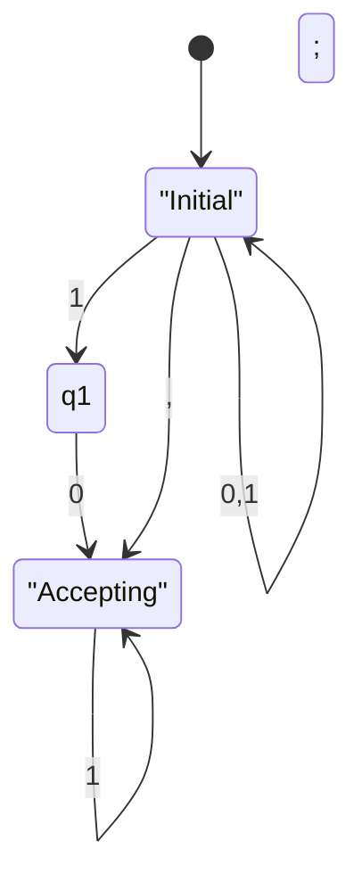
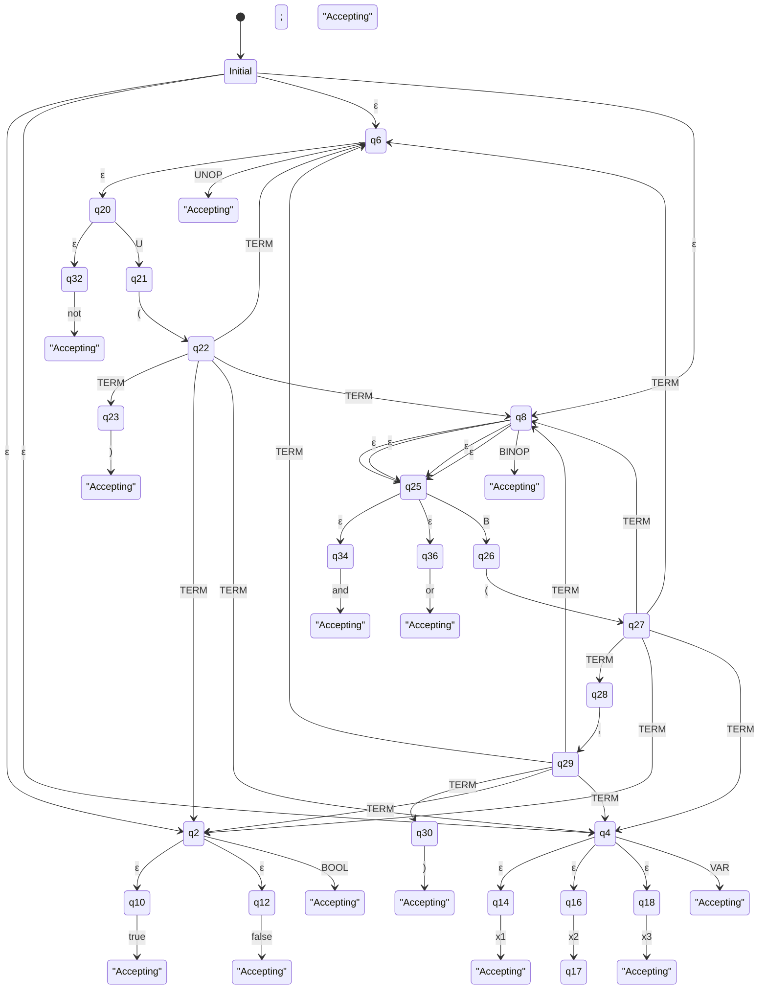
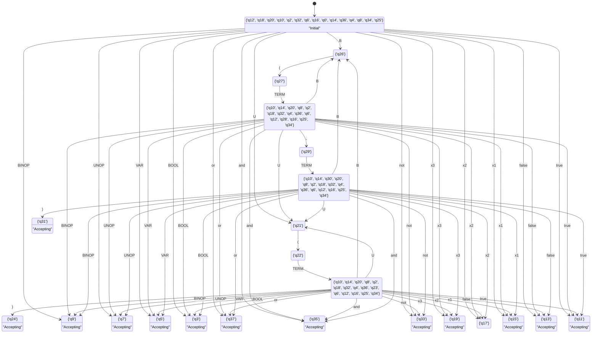

# Finite Automata Notes

## Non-Deterministic Finite Automata

### Example NFA Description

Let's say we have an NFA with the following components:

- **States**: `q0`, `q1`, `q2`
- **Alphabet**: `{0, 1}`
- **Transitions**:
  - `q0` --0--> `q0`
  - `q0` --1--> `q0`
  - `q0` --1--> `q1`
  - `q1` --0--> `q2`
  - `q2` --1--> `q2`
- **Initial State**: `q0`
- **Accepting States**: `q2`

### Mermaid Syntax for NFA

You can represent this NFA using the following Mermaid code:

### Breakdown of Mermaid Code

- `stateDiagram-v2`: Specifies that we're using Mermaid's state diagram syntax version 2.
- `[ * ] --> q0`: The start state of the NFA is `q0`.
- `q0 --> q0: 0,1`: State `q0` transitions to itself on input `0` or `1`.
- `q0 --> q1: 1`: State `q0` transitions to `q1` on input `1`.
- `q1 --> q2: 0`: State `q1` transitions to `q2` on input `0`.
- `q2 --> q2: 1`: State `q2` transitions to itself on input `1`.
- `state q0 { ... }` and `state q2 { ... }`: Optionally define internal states or styling. Here, they show `q0` and `q2` as initial and accepting states, respectively.
- `q0: Initial` and `q2: Accepting`: Add labels for the initial and accepting states.

### How to Use Mermaid Code

1. **Online Editors**: You can use online Mermaid live editors like [Mermaid Live Editor](https://mermaid-js.github.io/mermaid-live-editor) to visualize and edit your Mermaid diagrams.
2. **Markdown Files**: If you're using a tool that supports Mermaid in Markdown files (like certain GitHub markdown files or documentation tools), you can directly include the Mermaid code block in your Markdown file.

Feel free to adjust the transitions, states, and labels according to your specific NFA requirements!

---

### NFA Diagramn

#### Terminals

- true
- false
- x1
- x2
- x3
- (
- )
- ,
- not
- and
- or
- ε

#### Non-Terminals

- TERM
- BOOL
- VAR
- UNOP
- BINOP
- B
- U

#### Initial State:

- `q0`

#### Accepting States:

- `q1`
- `q3`
- `q5`
- `q7`
- `q9`
- `q11`
- `q13`
- `q15`
- `q19`
- `q24`
- `q31`
- `q33`
- `q35`
- `q37`

#### Transitions

- `q0` --ε--> `q2`
- `q0` --ε--> `q4`
- `q0` --ε--> `q6`
- `q0` --ε--> `q8`
- `q2` --ε--> `q10`
- `q2` --ε--> `q12`
- `q4` --ε--> `q14`
- `q4` --ε--> `q16`
- `q4` --ε--> `q18`
- `q6` --ε--> `q20`
- `q8` --ε--> `q25`
- `q20` --ε--> `q32`
- `q25` --ε--> `q34`
- `q25` --ε--> `q36`
- `q8` --ε--> `q25`
- `q8` --ε--> `q25`
- `q8` --ε--> `q25`
- `q2` --BOOL--> `q3`
- `q4` --VAR--> `q5`
- `q6` --UNOP--> `q7`
- `q8` --BINOP--> `q9`
- `q10` --true--> `q11`
- `q12` --false--> `q13`
- `q14` --x1--> `q15`
- `q16` --x2--> `q17`
- `q18` --x3--> `q19`
- `q20` --U--> `q21`
- `q21` --(--> `q22`
- `q22` --TERM--> `q23`
- `q22` --TERM--> `q2`
- `q22` --TERM--> `q4`
- `q22` --TERM--> `q6`
- `q22` --TERM--> `q8`
- `q23` --)--> `q24`
- `q25` --B--> `q26`
- `q26` --(--> `q27`
- `q27` --TERM--> `q28`
- `q27` --TERM--> `q2`
- `q27` --TERM--> `q4`
- `q27` --TERM--> `q6`
- `q27` --TERM--> `q8`
- `q28` --,--> `q29`
- `q29` --TERM--> `q30`
- `q29` --TERM--> `q2`
- `q29` --TERM--> `q4`
- `q29` --TERM--> `q6`
- `q29` --TERM--> `q8`
- `q30` --)--> `q31`
- `q32` --not--> `q33`
- `q34` --and--> `q35`
- `q36` --or--> `q37`

#### Mermaid Code and Image

stateDiagram-v2
    [*] --> q0

    q0 --> q2: ε;
    q0 --> q4: ε;
    q0 --> q6: ε;
    q0 --> q8: ε;

    q2 --> q10: ε;
    q2 --> q12: ε;
    q4 --> q14: ε;
    q4 --> q16: ε;
    q4 --> q18: ε;
    q6 --> q20: ε;
    q8 --> q25: ε;
    q20 --> q32: ε;
    q25 --> q34: ε;
    q25 --> q36: ε;

    q8 --> q25: ε;
    q8 --> q25: ε;
    q8 --> q25: ε;

    q2 --> q3: BOOL
    q4 --> q5: VAR
    q6 --> q7: UNOP
    q8 --> q9: BINOP

    q10 --> q11: true
    q12 --> q13: false
    q14 --> q15: x1
    q16 --> q17: x2
    q18 --> q19: x3
    q20 --> q21: U
    q21 --> q22: (
    q22 --> q23: TERM
    q22 --> q2: TERM
    q22 --> q4: TERM
    q22 --> q6: TERM
    q22 --> q8: TERM
    q23 --> q24: )

    q25 --> q26: B
    q26 --> q27: (
    q27 --> q28: TERM
    q27 --> q2: TERM
    q27 --> q4: TERM
    q27 --> q6: TERM
    q27 --> q8: TERM
    q28 --> q29: ,
    q29 --> q30: TERM
    q29 --> q2: TERM
    q29 --> q4: TERM
    q29 --> q6: TERM
    q29 --> q8: TERM
    q30 --> q31: )

    q32 --> q33: not
    q34 --> q35: and
    q36 --> q37: or

    %% Define accepting states
    q1: "Accepting"
    q3: "Accepting"
    q5: "Accepting"
    q7: "Accepting"
    q9: "Accepting"
    q11: "Accepting"
    q13: "Accepting"
    q15: "Accepting"
    q19: "Accepting"
    q24: "Accepting"
    q31: "Accepting"
    q33: "Accepting"
    q35: "Accepting"
    q37: "Accepting"

    %% Define initial states
    q0: Initial

## Deterministic Finite Automata

### DFA States

{'q12', 'q18', 'q20', 'q10', 'q2', 'q32', 'q6', 'q16', 'q0', 'q14', 'q36', 'q4', 'q8', 'q34', 'q25'}
{'q11'}
{'q13'}
{'q15'}
{'q17'}
{'q19'}
{'q33'}
{'q35'}
{'q37'}
{'q3'}
{'q5'}
{'q7'}
{'q9'}
{'q26'}
{'q21'}
{'q27'}
{'q22'}
{'q18', 'q20', 'q10', 'q2', 'q32', 'q6', 'q16', 'q28', 'q8', 'q14', 'q4', 'q36', 'q12', 'q34', 'q25'}
{'q18', 'q20', 'q10', 'q2', 'q32', 'q6', 'q16', 'q8', 'q14', 'q4', 'q23', 'q36', 'q12', 'q34', 'q25'}
{'q29'}
{'q24'}
{'q18', 'q20', 'q10', 'q2', 'q32', 'q6', 'q16', 'q8', 'q14', 'q4', 'q36', 'q30', 'q12', 'q34', 'q25'}
{'q31'}

### DFA Initial State

{'q12', 'q18', 'q20', 'q10', 'q2', 'q32', 'q6', 'q16', 'q0', 'q14', 'q36', 'q4', 'q8', 'q34', 'q25'}

### DFA Accepting States

{'q19'}
{'q31'}
{'q33'}
{'q5'}
{'q7'}
{'q3'}
{'q9'}
{'q35'}
{'q24'}
{'q37'}
{'q13'}
{'q11'}
{'q15'}

### DFA Transitions

{'q12', 'q18', 'q20', 'q10', 'q2', 'q32', 'q6', 'q16', 'q0', 'q14', 'q36', 'q4', 'q8', 'q34', 'q25'} --true--> {'q11'}
{'q12', 'q18', 'q20', 'q10', 'q2', 'q32', 'q6', 'q16', 'q0', 'q14', 'q36', 'q4', 'q8', 'q34', 'q25'} --false--> {'q13'}
{'q12', 'q18', 'q20', 'q10', 'q2', 'q32', 'q6', 'q16', 'q0', 'q14', 'q36', 'q4', 'q8', 'q34', 'q25'} --x1--> {'q15'}
{'q12', 'q18', 'q20', 'q10', 'q2', 'q32', 'q6', 'q16', 'q0', 'q14', 'q36', 'q4', 'q8', 'q34', 'q25'} --x2--> {'q17'}
{'q12', 'q18', 'q20', 'q10', 'q2', 'q32', 'q6', 'q16', 'q0', 'q14', 'q36', 'q4', 'q8', 'q34', 'q25'} --x3--> {'q19'}
{'q12', 'q18', 'q20', 'q10', 'q2', 'q32', 'q6', 'q16', 'q0', 'q14', 'q36', 'q4', 'q8', 'q34', 'q25'} --not--> {'q33'}
{'q12', 'q18', 'q20', 'q10', 'q2', 'q32', 'q6', 'q16', 'q0', 'q14', 'q36', 'q4', 'q8', 'q34', 'q25'} --and--> {'q35'}
{'q12', 'q18', 'q20', 'q10', 'q2', 'q32', 'q6', 'q16', 'q0', 'q14', 'q36', 'q4', 'q8', 'q34', 'q25'} --or--> {'q37'}
{'q12', 'q18', 'q20', 'q10', 'q2', 'q32', 'q6', 'q16', 'q0', 'q14', 'q36', 'q4', 'q8', 'q34', 'q25'} --BOOL--> {'q3'}
{'q12', 'q18', 'q20', 'q10', 'q2', 'q32', 'q6', 'q16', 'q0', 'q14', 'q36', 'q4', 'q8', 'q34', 'q25'} --VAR--> {'q5'}
{'q12', 'q18', 'q20', 'q10', 'q2', 'q32', 'q6', 'q16', 'q0', 'q14', 'q36', 'q4', 'q8', 'q34', 'q25'} --UNOP--> {'q7'}
{'q12', 'q18', 'q20', 'q10', 'q2', 'q32', 'q6', 'q16', 'q0', 'q14', 'q36', 'q4', 'q8', 'q34', 'q25'} --BINOP--> {'q9'}
{'q12', 'q18', 'q20', 'q10', 'q2', 'q32', 'q6', 'q16', 'q0', 'q14', 'q36', 'q4', 'q8', 'q34', 'q25'} --B--> {'q26'}
{'q12', 'q18', 'q20', 'q10', 'q2', 'q32', 'q6', 'q16', 'q0', 'q14', 'q36', 'q4', 'q8', 'q34', 'q25'} --U--> {'q21'}
{'q26'} --(--> {'q27'}
{'q21'} --(--> {'q22'}
{'q27'} --TERM--> {'q18', 'q20', 'q10', 'q2', 'q32', 'q6', 'q16', 'q28', 'q8', 'q14', 'q4', 'q36', 'q12', 'q34', 'q25'}
{'q22'} --TERM--> {'q18', 'q20', 'q10', 'q2', 'q32', 'q6', 'q16', 'q8', 'q14', 'q4', 'q23', 'q36', 'q12', 'q34', 'q25'}
{'q18', 'q20', 'q10', 'q2', 'q32', 'q6', 'q16', 'q28', 'q8', 'q14', 'q4', 'q36', 'q12', 'q34', 'q25'} --true--> {'q11'}
{'q18', 'q20', 'q10', 'q2', 'q32', 'q6', 'q16', 'q28', 'q8', 'q14', 'q4', 'q36', 'q12', 'q34', 'q25'} --false--> {'q13'}
{'q18', 'q20', 'q10', 'q2', 'q32', 'q6', 'q16', 'q28', 'q8', 'q14', 'q4', 'q36', 'q12', 'q34', 'q25'} --x1--> {'q15'}
{'q18', 'q20', 'q10', 'q2', 'q32', 'q6', 'q16', 'q28', 'q8', 'q14', 'q4', 'q36', 'q12', 'q34', 'q25'} --x2--> {'q17'}
{'q18', 'q20', 'q10', 'q2', 'q32', 'q6', 'q16', 'q28', 'q8', 'q14', 'q4', 'q36', 'q12', 'q34', 'q25'} --x3--> {'q19'}
{'q18', 'q20', 'q10', 'q2', 'q32', 'q6', 'q16', 'q28', 'q8', 'q14', 'q4', 'q36', 'q12', 'q34', 'q25'} --,--> {'q29'}
{'q18', 'q20', 'q10', 'q2', 'q32', 'q6', 'q16', 'q28', 'q8', 'q14', 'q4', 'q36', 'q12', 'q34', 'q25'} --not--> {'q33'}
{'q18', 'q20', 'q10', 'q2', 'q32', 'q6', 'q16', 'q28', 'q8', 'q14', 'q4', 'q36', 'q12', 'q34', 'q25'} --and--> {'q35'}
{'q18', 'q20', 'q10', 'q2', 'q32', 'q6', 'q16', 'q28', 'q8', 'q14', 'q4', 'q36', 'q12', 'q34', 'q25'} --or--> {'q37'}
{'q18', 'q20', 'q10', 'q2', 'q32', 'q6', 'q16', 'q28', 'q8', 'q14', 'q4', 'q36', 'q12', 'q34', 'q25'} --BOOL--> {'q3'}
{'q18', 'q20', 'q10', 'q2', 'q32', 'q6', 'q16', 'q28', 'q8', 'q14', 'q4', 'q36', 'q12', 'q34', 'q25'} --VAR--> {'q5'}
{'q18', 'q20', 'q10', 'q2', 'q32', 'q6', 'q16', 'q28', 'q8', 'q14', 'q4', 'q36', 'q12', 'q34', 'q25'} --UNOP--> {'q7'}
{'q18', 'q20', 'q10', 'q2', 'q32', 'q6', 'q16', 'q28', 'q8', 'q14', 'q4', 'q36', 'q12', 'q34', 'q25'} --BINOP--> {'q9'}
{'q18', 'q20', 'q10', 'q2', 'q32', 'q6', 'q16', 'q28', 'q8', 'q14', 'q4', 'q36', 'q12', 'q34', 'q25'} --B--> {'q26'}
{'q18', 'q20', 'q10', 'q2', 'q32', 'q6', 'q16', 'q28', 'q8', 'q14', 'q4', 'q36', 'q12', 'q34', 'q25'} --U--> {'q21'}
{'q18', 'q20', 'q10', 'q2', 'q32', 'q6', 'q16', 'q8', 'q14', 'q4', 'q23', 'q36', 'q12', 'q34', 'q25'} --true--> {'q11'}
{'q18', 'q20', 'q10', 'q2', 'q32', 'q6', 'q16', 'q8', 'q14', 'q4', 'q23', 'q36', 'q12', 'q34', 'q25'} --false--> {'q13'}
{'q18', 'q20', 'q10', 'q2', 'q32', 'q6', 'q16', 'q8', 'q14', 'q4', 'q23', 'q36', 'q12', 'q34', 'q25'} --x1--> {'q15'}
{'q18', 'q20', 'q10', 'q2', 'q32', 'q6', 'q16', 'q8', 'q14', 'q4', 'q23', 'q36', 'q12', 'q34', 'q25'} --x2--> {'q17'}
{'q18', 'q20', 'q10', 'q2', 'q32', 'q6', 'q16', 'q8', 'q14', 'q4', 'q23', 'q36', 'q12', 'q34', 'q25'} --x3--> {'q19'}
{'q18', 'q20', 'q10', 'q2', 'q32', 'q6', 'q16', 'q8', 'q14', 'q4', 'q23', 'q36', 'q12', 'q34', 'q25'} --)--> {'q24'}
{'q18', 'q20', 'q10', 'q2', 'q32', 'q6', 'q16', 'q8', 'q14', 'q4', 'q23', 'q36', 'q12', 'q34', 'q25'} --not--> {'q33'}
{'q18', 'q20', 'q10', 'q2', 'q32', 'q6', 'q16', 'q8', 'q14', 'q4', 'q23', 'q36', 'q12', 'q34', 'q25'} --and--> {'q35'}
{'q18', 'q20', 'q10', 'q2', 'q32', 'q6', 'q16', 'q8', 'q14', 'q4', 'q23', 'q36', 'q12', 'q34', 'q25'} --or--> {'q37'}
{'q18', 'q20', 'q10', 'q2', 'q32', 'q6', 'q16', 'q8', 'q14', 'q4', 'q23', 'q36', 'q12', 'q34', 'q25'} --BOOL--> {'q3'}
{'q18', 'q20', 'q10', 'q2', 'q32', 'q6', 'q16', 'q8', 'q14', 'q4', 'q23', 'q36', 'q12', 'q34', 'q25'} --VAR--> {'q5'}
{'q18', 'q20', 'q10', 'q2', 'q32', 'q6', 'q16', 'q8', 'q14', 'q4', 'q23', 'q36', 'q12', 'q34', 'q25'} --UNOP--> {'q7'}
{'q18', 'q20', 'q10', 'q2', 'q32', 'q6', 'q16', 'q8', 'q14', 'q4', 'q23', 'q36', 'q12', 'q34', 'q25'} --BINOP--> {'q9'}
{'q18', 'q20', 'q10', 'q2', 'q32', 'q6', 'q16', 'q8', 'q14', 'q4', 'q23', 'q36', 'q12', 'q34', 'q25'} --B--> {'q26'}
{'q18', 'q20', 'q10', 'q2', 'q32', 'q6', 'q16', 'q8', 'q14', 'q4', 'q23', 'q36', 'q12', 'q34', 'q25'} --U--> {'q21'}
{'q29'} --TERM--> {'q18', 'q20', 'q10', 'q2', 'q32', 'q6', 'q16', 'q8', 'q14', 'q4', 'q36', 'q30', 'q12', 'q34', 'q25'}
{'q18', 'q20', 'q10', 'q2', 'q32', 'q6', 'q16', 'q8', 'q14', 'q4', 'q36', 'q30', 'q12', 'q34', 'q25'} --true--> {'q11'}
{'q18', 'q20', 'q10', 'q2', 'q32', 'q6', 'q16', 'q8', 'q14', 'q4', 'q36', 'q30', 'q12', 'q34', 'q25'} --false--> {'q13'}
{'q18', 'q20', 'q10', 'q2', 'q32', 'q6', 'q16', 'q8', 'q14', 'q4', 'q36', 'q30', 'q12', 'q34', 'q25'} --x1--> {'q15'}
{'q18', 'q20', 'q10', 'q2', 'q32', 'q6', 'q16', 'q8', 'q14', 'q4', 'q36', 'q30', 'q12', 'q34', 'q25'} --x2--> {'q17'}
{'q18', 'q20', 'q10', 'q2', 'q32', 'q6', 'q16', 'q8', 'q14', 'q4', 'q36', 'q30', 'q12', 'q34', 'q25'} --x3--> {'q19'}
{'q18', 'q20', 'q10', 'q2', 'q32', 'q6', 'q16', 'q8', 'q14', 'q4', 'q36', 'q30', 'q12', 'q34', 'q25'} --)--> {'q31'}
{'q18', 'q20', 'q10', 'q2', 'q32', 'q6', 'q16', 'q8', 'q14', 'q4', 'q36', 'q30', 'q12', 'q34', 'q25'} --not--> {'q33'}
{'q18', 'q20', 'q10', 'q2', 'q32', 'q6', 'q16', 'q8', 'q14', 'q4', 'q36', 'q30', 'q12', 'q34', 'q25'} --and--> {'q35'}
{'q18', 'q20', 'q10', 'q2', 'q32', 'q6', 'q16', 'q8', 'q14', 'q4', 'q36', 'q30', 'q12', 'q34', 'q25'} --or--> {'q37'}
{'q18', 'q20', 'q10', 'q2', 'q32', 'q6', 'q16', 'q8', 'q14', 'q4', 'q36', 'q30', 'q12', 'q34', 'q25'} --BOOL--> {'q3'}
{'q18', 'q20', 'q10', 'q2', 'q32', 'q6', 'q16', 'q8', 'q14', 'q4', 'q36', 'q30', 'q12', 'q34', 'q25'} --VAR--> {'q5'}
{'q18', 'q20', 'q10', 'q2', 'q32', 'q6', 'q16', 'q8', 'q14', 'q4', 'q36', 'q30', 'q12', 'q34', 'q25'} --UNOP--> {'q7'}
{'q18', 'q20', 'q10', 'q2', 'q32', 'q6', 'q16', 'q8', 'q14', 'q4', 'q36', 'q30', 'q12', 'q34', 'q25'} --BINOP--> {'q9'}
{'q18', 'q20', 'q10', 'q2', 'q32', 'q6', 'q16', 'q8', 'q14', 'q4', 'q36', 'q30', 'q12', 'q34', 'q25'} --B--> {'q26'}
{'q18', 'q20', 'q10', 'q2', 'q32', 'q6', 'q16', 'q8', 'q14', 'q4', 'q36', 'q30', 'q12', 'q34', 'q25'} --U--> {'q21'}

### Mermaid Code and Image

stateDiagram-v2
    state "{'q12', 'q18', 'q20', 'q10', 'q2', 'q32', 'q6', 'q16', 'q0', 'q14', 'q36', 'q4', 'q8', 'q34', 'q25'}" as S0
    state "{'q11'}" as S1
    state "{'q13'}" as S2
    state "{'q15'}" as S3
    state "{'q17'}" as S4
    state "{'q19'}" as S5
    state "{'q33'}" as S6
    state "{'q35'}" as S7
    state "{'q37'}" as S8
    state "{'q3'}" as S9
    state "{'q5'}" as S10
    state "{'q7'}" as S11
    state "{'q9'}" as S12
    state "{'q26'}" as S13
    state "{'q21'}" as S14
    state "{'q27'}" as S15
    state "{'q22'}" as S16
    state "{'q10', 'q14', 'q20', 'q8', 'q2', 'q18', 'q32', 'q4', 'q36', 'q6', 'q12', 'q28', 'q16', 'q25', 'q34'}" as S17
    state "{'q10', 'q14', 'q20', 'q8', 'q2', 'q18', 'q32', 'q4', 'q36', 'q23', 'q6', 'q12', 'q16', 'q25', 'q34'}" as S18
    state "{'q29'}" as S19
    state "{'q24'}" as S20
    state "{'q10', 'q14', 'q30', 'q20', 'q8', 'q2', 'q18', 'q32', 'q4', 'q36', 'q6', 'q12', 'q16', 'q25', 'q34'}" as S21
    state "{'q31'}" as S22

    [*] --> S0
    S0 --> S1 : true
    S0 --> S2 : false
    S0 --> S3 : x1
    S0 --> S4 : x2
    S0 --> S5 : x3
    S0 --> S6 : not
    S0 --> S7 : and
    S0 --> S8 : or
    S0 --> S9 : BOOL
    S0 --> S10 : VAR
    S0 --> S11 : UNOP
    S0 --> S12 : BINOP
    S0 --> S13 : B
    S0 --> S14 : U
    S13 --> S15 : (
    S14 --> S16 : (
    S15 --> S17 : TERM
    S16 --> S18 : TERM
    S17 --> S1 : true
    S17 --> S2 : false
    S17 --> S3 : x1
    S17 --> S4 : x2
    S17 --> S5 : x3
    S17 --> S19 : ,
    S17 --> S6 : not
    S17 --> S7 : and
    S17 --> S8 : or
    S17 --> S9 : BOOL
    S17 --> S10 : VAR
    S17 --> S11 : UNOP
    S17 --> S12 : BINOP
    S17 --> S13 : B
    S17 --> S14 : U
    S18 --> S1 : true
    S18 --> S2 : false
    S18 --> S3 : x1
    S18 --> S4 : x2
    S18 --> S5 : x3
    S18 --> S20 : )
    S18 --> S6 : not
    S18 --> S7 : and
    S18 --> S8 : or
    S18 --> S9 : BOOL
    S18 --> S10 : VAR
    S18 --> S11 : UNOP
    S18 --> S12 : BINOP
    S18 --> S13 : B
    S18 --> S14 : U
    S19 --> S21 : TERM
    S21 --> S1 : true
    S21 --> S2 : false
    S21 --> S3 : x1
    S21 --> S4 : x2
    S21 --> S5 : x3
    S21 --> S22 : )
    S21 --> S6 : not
    S21 --> S7 : and
    S21 --> S8 : or
    S21 --> S9 : BOOL
    S21 --> S10 : VAR
    S21 --> S11 : UNOP
    S21 --> S12 : BINOP
    S21 --> S13 : B
    S21 --> S14 : U

    %% Define accepting states
    S5 : "Accepting"
    S22 : "Accepting"
    S6 : "Accepting"
    S10 : "Accepting"
    S11 : "Accepting"
    S9 : "Accepting"
    S12 : "Accepting"
    S7 : "Accepting"
    S20 : "Accepting"
    S8 : "Accepting"
    S2 : "Accepting"
    S1 : "Accepting"
    S3 : "Accepting"

    %% Define initial states
    S0: "Initial"

### Table Structure

| NFA States                                                                                            | States | true | false | x1 | x2 | x3 | not | and | or | BOOL | VAR | UNOP | BINOP | B   | U   | (   | )   | ,   | TERM | $      |
| ----------------------------------------------------------------------------------------------------- | ------ | ---- | ----- | -- | -- | -- | --- | --- | -- | ---- | --- | ---- | ----- | --- | --- | --- | --- | --- | ---- | ------ |
| {'q12', 'q18', 'q20', 'q10', 'q2', 'q32', 'q6', 'q16', 'q0', 'q14', 'q36', 'q4', 'q8', 'q34', 'q25'}  | 0      | s1   | s2    | s3 | s4 | s5 | s6  | s7  | s8 | g9   | g10 | g11  | g12   | g13 | g14 |     |     |     |      |        |
| {'q11'}                                                                                               | 1      |      |       |    |    |    |     |     |    |      |     |      |       |     |     | r1  | r1  | r1  |      | accept |
| {'q13'}                                                                                               | 2      |      |       |    |    |    |     |     |    |      |     |      |       |     |     | r2  | r2  | r2  |      | accept |
| {'q15'}                                                                                               | 3      |      |       |    |    |    |     |     |    |      |     |      |       |     |     | r3  | r3  | r3  |      | accept |
| {'q17'}                                                                                               | 4      |      |       |    |    |    |     |     |    |      |     |      |       |     |     |     |     |     |      |        |
| {'q19'}                                                                                               | 5      |      |       |    |    |    |     |     |    |      |     |      |       |     |     | r5  | r5  | r5  |      | accept |
| {'q33'}                                                                                               | 6      |      |       |    |    |    |     |     |    |      |     |      |       |     |     | r6  | r6  | r6  |      | accept |
| {'q35'}                                                                                               | 7      |      |       |    |    |    |     |     |    |      |     |      |       |     |     | r7  | r7  | r7  |      | accept |
| {'q37'}                                                                                               | 8      |      |       |    |    |    |     |     |    |      |     |      |       |     |     | r8  | r8  | r8  |      | accept |
| {'q3'}                                                                                                | 9      |      |       |    |    |    |     |     |    |      |     |      |       |     |     | r9  | r9  | r9  |      | accept |
| {'q5'}                                                                                                | 10     |      |       |    |    |    |     |     |    |      |     |      |       |     |     | r10 | r10 | r10 |      | accept |
| {'q7'}                                                                                                | 11     |      |       |    |    |    |     |     |    |      |     |      |       |     |     | r11 | r11 | r11 |      | accept |
| {'q9'}                                                                                                | 12     |      |       |    |    |    |     |     |    |      |     |      |       |     |     | r12 | r12 | r12 |      | accept |
| {'q26'}                                                                                               | 13     |      |       |    |    |    |     |     |    |      |     |      |       |     |     | s15 |     |     |      |        |
| {'q21'}                                                                                               | 14     |      |       |    |    |    |     |     |    |      |     |      |       |     |     | s16 |     |     |      |        |
| {'q27'}                                                                                               | 15     |      |       |    |    |    |     |     |    |      |     |      |       |     |     |     |     |     | g17  |        |
| {'q22'}                                                                                               | 16     |      |       |    |    |    |     |     |    |      |     |      |       |     |     |     |     |     | g18  |        |
| {'q10', 'q14', 'q20', 'q8', 'q2', 'q18', 'q32', 'q4', 'q36', 'q6', 'q12', 'q28', 'q16', 'q25', 'q34'} | 17     | s1   | s2    | s3 | s4 | s5 | s6  | s7  | s8 | g9   | g10 | g11  | g12   | g13 | g14 |     |     | s19 |      |        |
| {'q10', 'q14', 'q20', 'q8', 'q2', 'q18', 'q32', 'q4', 'q36', 'q23', 'q6', 'q12', 'q16', 'q25', 'q34'} | 18     | s1   | s2    | s3 | s4 | s5 | s6  | s7  | s8 | g9   | g10 | g11  | g12   | g13 | g14 |     | s20 |     |      |        |
| {'q29'}                                                                                               | 19     |      |       |    |    |    |     |     |    |      |     |      |       |     |     |     |     | s21 | g17  |        |
| {'q24'}                                                                                               | 20     |      |       |    |    |    |     |     |    |      |     |      |       |     |     | r20 | r20 | r20 |      | accept |
| {'q10', 'q14', 'q30', 'q20', 'q8', 'q2', 'q18', 'q32', 'q4', 'q36', 'q6', 'q12', 'q16', 'q25', 'q34'} | 21     | s1   | s2    | s3 | s4 | s5 | s6  | s7  | s8 | g9   | g10 | g11  | g12   | g13 | g14 |     | s22 |     |      |        |
| {'q31'}                                                                                               | 22     |      |       |    |    |    |     |     |    |      |     |      |       |     |     | r22 | r22 | r22 |      | accept |

This table includes the DFA states, their corresponding NFA states, and the transitions for each terminal and non-terminal.

### FOLLOW Sets

Summary of FOLLOW Sets

- FOLLOW(TERM) = {,, ), $}
- FOLLOW(BOOL) = {,, ), $}
- FOLLOW(VAR) = {,, ), $}
- FOLLOW(UNOP) = {,, ), $}
- FOLLOW(BINOP) = {,, ), $}
- FOLLOW(B) = {(}
- FOLLOW(U) = {(}

### More Information

When a DFA state contains an accepting NFA state marked with production number p, where the left-hand side nonterminal for p is N, find the symbols in FOLLOW(N) and add a reduce paction in the DFA state at all these symbols. If p=0, add an accept action instead of a reduce p action.

### Derivation

| Stack                                    | Input                   | Action                                    |
| ---------------------------------------- | ----------------------- | ----------------------------------------- |
| 0                                        | not(and(true,or(x2))) $ | Shift 'not' to state 14                   |
| 14 U                                     | (and(true,or(x2))) $    | Shift '(' to state 13                     |
| 14 U 13                                  | and(true,or(x2)) ) $    | Shift 'and' to state 7                    |
| 14 U 13 7 B                              | (true,or(x2)) ) $       | Shift '(' to state 13                     |
| 14 U 13 7 B 13                           | true,or(x2) ) $         | Shift 'true' to state 1                   |
| 14 U 13 7 B 13 1 BOOL                    | ,or(x2) ) $             | Shift ',' to state 19                     |
| 14 U 13 7 B 13 1 BOOL 19                 | or(x2) ) $              | Shift 'or' to state 8                     |
| 14 U 13 7 B 13 1 BOOL 19 8 B             | (x2) ) $                | Shift '(' to state 13                     |
| 14 U 13 7 B 13 1 BOOL 19 8 B 13          | x2 ) $                  | Shift 'x2' to state 4                     |
| 14 U 13 7 B 13 1 BOOL 19 8 B 13 4 VAR    | ) $                     | Shift ')' to state 16                     |
| 14 U 13 7 B 13 1 BOOL 19 8 B 13 4 VAR 16 | $                       | Apply rule 11: BINOP -> B ( TERM , TERM ) |
| 14 U 13 7 B 13 1 BOOL 19 8 BINOP         | $                       | Apply rule 4: TERM -> BINOP               |
| 14 U 13 7 B 13 1 BOOL 19 TERM            | $                       | Apply rule 11: BINOP -> B ( TERM , TERM ) |
| 14 U 13 7 B 13 1 BOOL BINOP              | $                       | Apply rule 4: TERM -> BINOP               |
| 14 U 13 7 B 13 TERM                      | $                       | Apply rule 3: TERM -> UNOP                |
| 14 U 13 7 TERM                           | $                       | Apply rule 10: UNOP -> U ( TERM )         |
| 14 U TERM                                | $                       | Apply rule 1: TERM -> BOOL                |
| 14 BOOL                                  | $                       | Accept                                    |

---

---
